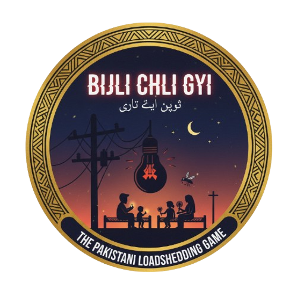
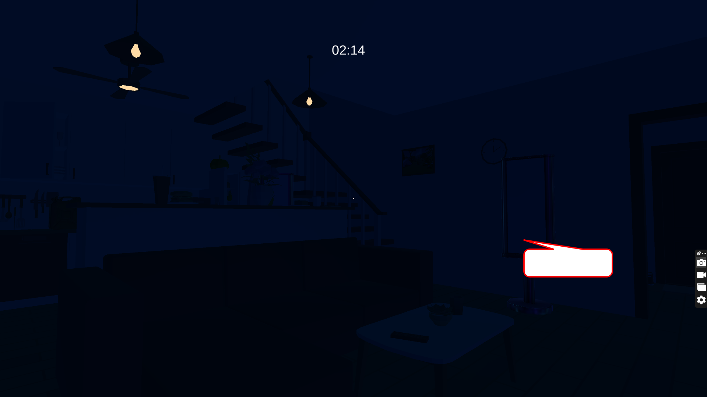
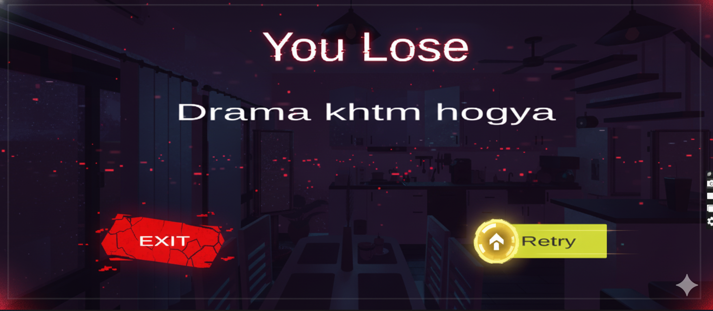

<h1 align="center">⚡ BIJLI CHALI GAYI ⚡</h1>

<p align="center">
  
</p>

<p align="center">
  
  
</p>

> **"Banish the darkness, restore the light! Time is ticking, and the power is out."**

---

## 🔥 Project Goal: **End the Darkness!**

**Bijli Chali Gayi** is a short, **Pakistani-themed**, story-driven **Survival Puzzle** game developed in **Unity (C#)**.

Your objective in the game is simple yet urgent: **Fix the generator and bring back electricity before time runs out!** It's a race against the clock where every second counts.

---

## 🕹️ Gameplay Objectives (Mission Goals)

Just 3 simple steps, but challenging:

1.  🔍 **Find the Jerry Can:** First, locate the empty jerry can.
2.  ⛽ **Fill the Fuel Barrel:** Fill the jerry can from the fuel barrel.
3.  ⚙️ **Start the Generator:** Pour the fuel and activate the generator!

✅ **Victory:** If you succeed - light returns.
❌ **Defeat:** If you fail - darkness Drama End.

---

## ✨ Key Features

* ⏱️ **Heart-Pounding Timer:** A dynamic countdown system that builds tension.
* ⚙️ **Generator Logic:** Realistic generator activation and lighting mechanics.
* 💡 **Interactive Task UI (T):** Press 'T' to view your current objectives.
* 🔊 **Immersive Sounds:** An ambiance that makes you feel truly present after a power outage.
* 🧠 **Clean C# Code:** Optimized and easy-to-understand code for new developers.
* 🇵🇰 **Pakistani Flavor:** A small, local-flavored gaming experience.

---

## 📸 Screenshots

| 🎮 Main Menu | 🕹️ Gameplay | 💀 Lose Screen |
| :---: | :---: | :---: |
|  |  |  |

---

## 🧰 Technologies & Tools Used

| Category | Tool / Language |
| :---: | :---: |
| **Engine** | `Unity` |
| **Language** | `C#` |
| **UI Rendering** | `TextMeshPro (TMP)` |
| **Version Control** | `Git` + `GitHub` |

---

## 🚀 How to Play (Getting Started)

1.  Clone this repository:
    ```bash
    git clone [https://github.com/YOUR_USERNAME/Bijli-Chali-Gayi.git](https://github.com/YOUR_USERNAME/Bijli-Chali-Gayi.git)
    ```
2.  Open the project using Unity Hub.
3.  Load the `Scenes/MainScene.unity` file.
4.  Press the Play button (▶️) and start battling the darkness!

---

## 🤝 Credits & Developer

This project was developed by **Munib Jahangir**. If you enjoyed this project, feel free to connect on social media!

| Platform | Link |
| :---: | :---: |
| **LinkedIn** | [Connect with Munib Jahangir](https://www.linkedin.com/in/munib-jahangir-48b16638b) |
| **YouTube** | [Munib's YouTube Channel](https://www.youtube.com/@MunibJahangirDev) |
| **Instagram** | [Follow Munib on Instagram](https://www.instagram.com/munib_jahangir) |

---
> **Final Note:** If you encounter any bugs, please feel free to raise an issue. Your feedback will help improve the project!
